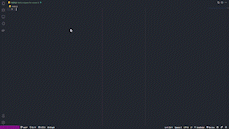

<!-- colocar a imagem da pasta image -->

# fastify-snippets

<br/>
<p align="center">
  
  
  
  <imag alt="Downloads" src="https://img.shields.io/visual-studio-marketplace/d/ManuCodes.nestjs.snippets?style=for-the-badge&color=df85ff&labelColor=384357">
  
  
</p>
<br/>

# Fastify Snippets for VS Code

The Fastifty extension lets you use a set of snippets to create a Fastify project. It is a great way to start a new project with Fastify. It is also a great way to learn Fastify. It is also a great way to learn Fastify.

* Develop with a fastify project with a few clicks.
* Learn Fastify with a few clicks.
* Create a Fastify project with a few clicks.

**Updated for Fastify 0.0.4 release**

This extension for Visual Studio Code adds snippets for Fastify for TypeScript and JavaScript.

<h1>
  
</h1>

## System Requirements

***Local***:

  * ***Windows***: 2.0+ on Windows 10 Pro/Enterprise. Windows 10 Home (2004+) requires Docker Desktop 2.2+ and the WSL2 back-end. (Docker Toolbox is not supported.)

  * ***macOS***: 2.0+ on macOS 10.13+. (Docker Toolbox is not supported.) Docker Desktop 2.2+ requires macOS 10.14+.

  * ***Linux***: 2.0+ on any 64-bit distribution that supports Docker Engine 1.13+ and Docker Compose 1.10+. (Docker Toolbox is not supported.)

***Remote***:

  * ***Windows***: 2.0+ on Windows 10 Pro/Enterprise. Windows 10 Home (2004+) requires Docker Desktop 2.2+ and the WSL2 back-end. (Docker Toolbox is not supported.)

  * ***macOS***: 2.0+ on macOS 10.13+. (Docker Toolbox is not supported.) Docker Desktop 2.2+ requires macOS 10.14+.

  * ***Linux***: 2.0+ on any 64-bit distribution that supports Docker Engine 1.13+ and Docker Compose 1.10+. (Docker Toolbox is not supported.)

See the [CHANGELOG](CHANGELOG.md) for the latest changes

Install it from the [VSCode marketplace](https://marketplace.visualstudio.com/items?itemName=EstevamSouza.fastify-snippets-for-vscode)!

For more information, take a look a the [VSCode documentation](https://code.visualstudio.com/docs/editor/userdefinedsnippets)

## Prerequisite

- [Node.js](https://nodejs.org/en/download/)
- [TypeScript](https://www.typescriptlang.org/)
- [VSCode](https://code.visualstudio.com/)

## System Requirements

- [VSCode](https://code.visualstudio.com/) v1.41.0 or higher

## Sponsor

I open-source almost everything I can, and I try to reply to everyone needing help using these projects. Obviously,
this takes time. You can use this service for free.

However, if you are using this project and are happy with it or just want to encourage me to continue creating stuff, there are a few ways you can do it:-

- Giving proper credit when you use github-readme-stats on your readme, linking back to it :D
- Starring and sharing the project :rocket: I'll probably buy a ~~coffee~~ tea. :tea:

<a href="https://github.com/sponsors/estevam5s" target="_blank"></a>

## Installation

1. Open **Extensions** sidebar panel in VS Code. `View → Extensions`
2. Search for `The Ultimate Fastify Snippets`
3. Click **Install** to install it.
4. Code your Nest.js app.

* Open the Command Palette (⇧⌘P (Windows, Linux Ctrl+Shift+P)) and type `The Ultimate Fastify Snippets` to see all available commands.

> **Note:** If you have any issues, please [report it](https://gtihub.com/estevam5s/fastify-snippets-for-vscode/issues).

## Can also be installed using the command line

```bash
code --install-extension fastify-snippets-for-vscode
```

## JavaScript Snippet Pack for Visual Studio Code

Download this extension from the [Visual Studio Code Marketplace](https://marketplace.visualstudio.com/items?itemName=EstevamSouza.fastify-snippets-for-vscode)

## Supported languages (file extensions)

- TypeScript (.ts)
- JavaScript (.js)
- JavaScript Next (.jsx)
- TypeScript React (.tsx)

## Snippets

Below is a list of all available snippets and the triggers of each one. The ⇥ means the TAB key. The ⏎ means the ENTER key. The ␣ means the SPACE key.

### Fastify Snippets Commands using `ff` prefix
> ff + tab or enter
* command: `ff`
* description: Fastify Snippets
* prefix: `ff`

### fastify using javascript and typescript

Trigger|Snippet|Description
---|---|---
`ffhello->`  |fastify hello server|Create an hello world server
`ffregister->`, `ffplugin->`  |fastify register|Add an empty plugin
`ffprintroutes->`  |fastify print routes|Print to stdout the routes tree
`fferrorhandler->`  |fastify error handler|Add a custom error handler
`ffdecorateserver->`  |fastify decorate server|Add a server decorator
`ffdecoraterequest->`  |fastify decorate request|Add a request decorator
`ffdecoratereply->`  |fastify decorate reply|Add a reply decorator
`ffonrequest->`, `hookonrequest->`  |fastify hook onRequest|Add an instance fastify onRequest hook
`ffpreparsing`, `hookpreparsing->`  |fastify hook preParsing|Add an instance fastify preParsing hook
`ffprevalidation`, `hookprevalidation->`  |fastify hook preValidation|Add an instance fastify preValidation hook
`ffprehandler`, `hookprehandler->`  |fastify hook preHandler|Add an instance fastify preHandler hook
`ffpreserialization`, `hookpreserialization->`  |fastify hook preSerialization|Add an instance fastify preSerialization hook
`ffonerror`, `hookonerror->`  |fastify hook onError|Add an instance fastify onError hook
`ffonsend`, `hookonsend->`  |fastify hook onSend|Add an instance fastify onSend hook
`ffonresponse`, `hookonresponse->`  |fastify hook onResponse|Add an instance fastify onResponse hook
`ffontimeout`, `hookontimeout->`  |fastify hook onTimeout|Add an instance fastify onTimeout hook
`ffonready`, `hookonready->`  |fastify application hook onReady|Add the fastify onReady application hook
`ffonclose`, `hookonclose->`  |fastify application hook onClose|Add the fastify onClose application hook
`ffonroute`, `hookonroute->`  |fastify application hook onRoute|Add the fastify onRoute application hook
`ffonregister`, `hookonregister->`  |fastify application hook onRegister|Add the fastify onRegister application hook
`ffaddschema`, `ffsharedschema->`, `ffjsonschema->`, `ffschema->`  |fastify add schema|Add a shared JSON schema to fastify
`ffnotfound->`, `ff404->`  |fastify not found handler|Add the default 404 not found handler
`fflisten->`, `ffstart->`  |fastify listen|Start the server listening on a given port
`ffclose->`, `ffstop->`  |fastify close|Close the server
`ffregisteropts ->` `ffpluginopts->`  |fastify register options|Add an empty plugin with options
`ffregistercb->`, `ffplugincb->`  |fastify register callback|Add an empty plugin with callback
`ffregisterasync`, `ffpluginasync->`  |fastify register async|Add an empty plugin with async
`ffregisterpromise->`, `ffpluginpromise->`  |fastify register promise|Add an empty plugin with promise
`ffregisteroptscb->`, `ffpluginoptscb->`  |fastify register options callback|Add an empty plugin with options and callback

### fastify hello server

In this example, we will create a simple hello world server using fastify. The server will listen on port 3000 and will respond with a JSON object containing a message property.

```javascript

import fastify from 'fastify'

const app = fastify({ logger: true })
app.get('/', async (request, reply) => {
  return { hello: 'world' }
})
app.post('/', async (request, reply) => {
  return request.body
})
app.listen(8080)

```

### fastify register

In this example, we will create a simple plugin using fastify. The plugin will register a new route and will respond with a JSON object containing a message property.

```javascript

fastify.register(async function (fastify, opts) {
  fastify.get('/', async (request, reply) => {
    return { hello: 'world' }
  })
})

```


## Contribute

Feel free to open an issue if you have suggestion o new ideas to improve this snippet!

## How to test

From VSCODE you can run the `Extension` launcher to test your snippet inside an headless VSCODE instance.

## How to release

First, you must be added into the [Fastify publisher](https://marketplace.visualstudio.com/manage/publishers/EstevamSouza) to complete succesfully these steps.

- Generate a [personal access token](https://code.visualstudio.com/api/working-with-extensions/publishing-extension#get-a-personal-access-token)
- Run `npm run vscode:login`
- Manually bump the version in the `package.json`
- Run `npm run vscode:pack`
- Run `npm run vscode:publish`

## Developement

Clone this package and open it in VS Code. Press `F5`  to open a new window with your extension loaded.

> Note that the files are watched, so you can edit the files and reload the window to test your changes. You can also run the `Extension` launch configuration to run the extension without debugging.

## Change log

### 2.0.0 (2023-03-15) 

- Added support for NestJS
- Added support for AdonisJS
- Fastify Snippets Improvements (Typescript and Javascript)

### 0.0.3 (2022-11-19)

- Documentation improvements and new snippets 🚀🚀

### 0.0.2 (2022-11-19)

- Add typescript snippets 🚀

### 0.0.1 (2022-11-19)

- Initial release 🎉

## License

Licensed under [MIT](./LICENSE).
