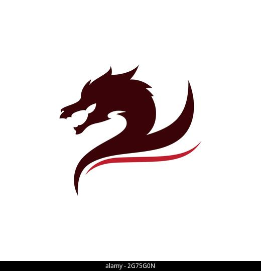
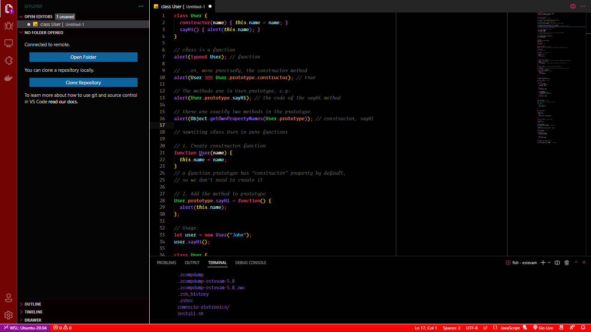

  

<h2 align="center">nestjs full color theme</h2>
<h5 align="center">Created for you, by <a href="https://github.com/estevam5s">@nestjs.theme</a></h5>

A bright, modern, contrasting dark theme for Visual Studio Code 🦄

*Light theme coming **soon*** 🌙

## **👨‍🚀 Author**

<!-- colocar uma imagem do autor -->

👋 My Contacts:

<!-- CONTACTS -->
[author-linkedin]: https://linkedin.com/in/estevam5s
[author-email]: mailto:ack@baibay.id
[author-github]: https://github.com/estevam5s

Made with ❤️ by [Estevam Souza](https://github.com/estevam5s)

## Contributors

<table>
  <tr>
    <td align="center"><a href="https://github.com/estevam5s" target="_blank"> <b>Estevam Souza</b></a> <a title="Code">💻</a></td>
  </tr>
</table>